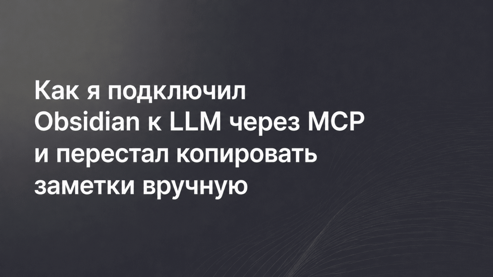

---
<!-- Ниже — дословный stdout модели gpt-oss-120b:free (verbatim). Метаданные и разбор — в README.md. -->

**Дайджест новостей по теме AI/ML (период 2026‑06‑07 – 2026‑06‑14)**  

🖼️ Обложка – из первой статьи списка: https://habrastorage.org/r/w1560/getpro/habr/upload_files/4c0/e37/47c/4c0e3747cc0e2473eef794cdc952e5a8.png  

---

### 1. Как я подключил Obsidian к LLM через MCP и перестал копировать заметки вручную  
**TL;DR:** Автор реализовал MCP‑сервер, который экспонирует хранилище Obsidian‑vault как набор операций (просмотр дерева, чтение/запись файлов, поиск). Любой LLM‑клиент (Cursor, ChatGPT и др.) теперь может напрямую читать и изменять заметки, генерировать контекст и возвращать ответы без ручного копипаста. Проект открыт на GitHub и полностью докеризован.  
**Ссылка:** https://habr.com/ru/articles/1047038/

### 2. Один суффикс, чтобы взломать их всех  
**TL;DR:** Обзор градиентных атак на крупные языковые модели (GCG, AutoDAN и их потомки). Авторы показывают, как небольшие токен‑суффиксы заставляют модели генерировать нежелательный контент, доказывают высокую переносимость атак между разными моделями и обсуждают ограниченную эффективность простых фильтров — нужны более глубокие защиты.  
**Ссылка:** https://habr.com/ru/articles/1046890/

### 3. Язык, который придумали для ИИ в 1958‑м  
**TL;DR:** Рассказ о зарождении LISP как первого языка для искусственного интеллекта. В статье описаны ключевые инновации — garbage collection, код‑как‑данные, REPL и макросистема — и их влияние на последующие языки (Python, Clojure). Кроме исторических фактов, подчёркивается, как идеи LISP вновь возвращаются в современных агентных системах.  
**Ссылка:** https://habr.com/ru/articles/1046996/

### 4. Создаем автономный анализатор логов на локальных ИИ‑моделях  
**TL;DR:** Автор построил пайплайн, где локальная LLM (llama.cpp) читает поток системных журналов, классифицирует сообщения (ignore/warning/critical) и автоматически отправляет оповещения в Mattermost. Проект полностью открытый, включает Docker‑образ, скрипт‑агент и инструкции по развёртыванию на сервере с GPU.  
**Ссылка:** https://habr.com/ru/articles/1046409/

### 5. OpenClaw и LabelStudio: расширяем каталог AI‑маркетплейса Selectel  
**TL;DR:** В AI‑маркетплейсе Selectel добавлены два инструмента — self‑hosted AI‑агент OpenClaw для автоматизации рутинных задач и платформа разметки LabelStudio для мультимодальных датасетов. Оба сервиса разворачиваются в один клик, поддерживают подключение к внешним ML‑бэкендам и S3‑совместимому хранилищу, что ускоряет подготовку данных для обучения.  
**Ссылка:** https://habr.com/ru/articles/1046610/

### 6. Stack Overflow запустила отдельную платформу для AI‑агентов  
**TL;DR:** Stack Overflow представил сервис, позволяющий AI‑агентам обмениваться проверенными решениями кода. Платформа предоставляет единый интерфейс для доступа к высококачественным ответам, снижая количество ошибок при генерации кода LLM‑моделями. Ожидается интеграция с популярными SDK и API.  
**Ссылка:** https://habr.com/ru/articles/1046497/

### 7. Первый на рынке или быстрый второй: почему 47 % пионеров проигрывают — и какая стратегия подходит именно вам?  
**TL;DR:** Аналитика о стратегиях выхода на рынок AI‑продуктов. Автор приводит данные, что почти половина первых игроков теряет позиции, а «быстрый второй» с улучшенными предложениями часто выигрывает. Рекомендации включают оценку ресурсоёмкости, тайм‑трекинг и выбор подхода (первый / быстрый второй) в зависимости от команды и продукта.  
**Ссылка:** https://habr.com/ru/articles/1046489/

---

**Вывод:** За прошедшую неделю AI‑сообщество активно развивает интеграцию LLM с пользовательскими инструментами (Obsidian, локальный лог‑анализ), исследует уязвимости моделей (адверсариальные суффиксы) и расширяет инфраструктуру для разметки и автоматизации (OpenClaw, LabelStudio). Плюс появляются новые платформы обмена знаниями (Stack Overflow AI) и стратегические размышления о позиционировании на рынке. Всё это указывает на ускоренное внедрение ИИ‑технологий как в продуктивные, так и в исследовательские процессы.
