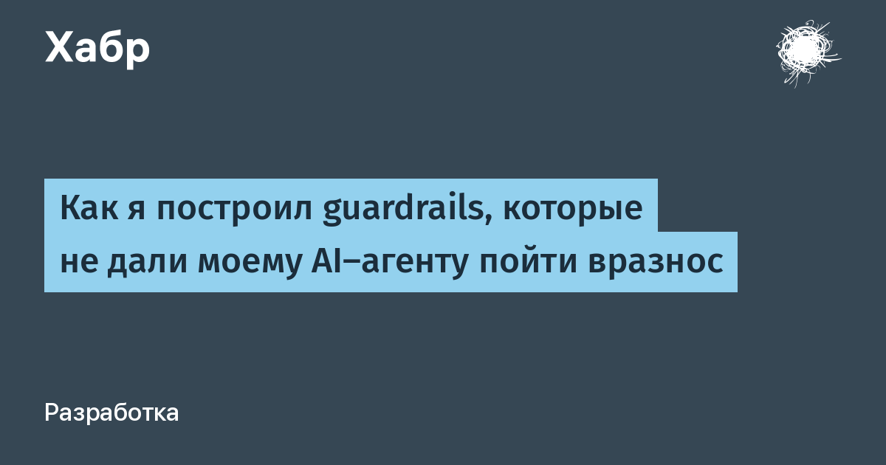

# Пример дайджеста: AI/ML за 7 дней

**Модель:** `openai/gpt-oss-120b:free` (через OpenRouter)  
**Дата генерации:** 2026-06-13  
**Способ запуска:** Hermes CLI, one-shot режим (`hermes -z "..."`), без Telegram  
**Команда:**
```
docker compose run --rm hermes-agent -z "собери дайджест по теме AI / ML за последнюю неделю"
```

**Подтверждение вызовов MCP-инструментов** (из логов контейнера `mcp-news`):
```
[mcp-news] TOOL CALL: search_habr(query=AI ML, period=7d, limit=20)
[mcp-news] search_habr returned count=20
[mcp-news] TOOL CALL: fetch_article(url=https://habr.com/ru/articles/1047022/)
[mcp-news] fetch_article(https://habr.com/ru/articles/1047022/) → ok
[mcp-news] TOOL CALL: fetch_article(url=https://habr.com/ru/articles/1043848/)
[mcp-news] fetch_article(https://habr.com/ru/articles/1043848/) → ok
[mcp-news] TOOL CALL: fetch_article(url=https://habr.com/ru/articles/1046918/)
[mcp-news] fetch_article(https://habr.com/ru/articles/1046918/) → ok
[mcp-news] TOOL CALL: fetch_article(url=https://habr.com/ru/articles/1046942/)
[mcp-news] fetch_article(https://habr.com/ru/articles/1046942/) → ok
[mcp-news] TOOL CALL: fetch_article(url=https://habr.com/ru/articles/1045394/)
[mcp-news] fetch_article(https://habr.com/ru/articles/1045394/) → ok
```

---

## Дайджест (verbatim — вывод агента)

<figure>
  
  <figcaption><em>Обложка дайджеста — лид-картинка (<code>og:image</code>) ведущей статьи №1. В Telegram она отправляется отдельным фото с подписью (заголовок + вводка) перед телом дайджеста; в этом CLI-прогоне обложка добавлена сюда для наглядности.</em></figcaption>
</figure>

**Дайджест AI / ML за последнюю неделю (7 дней)**
*Период: 2026‑06‑07 – 2026‑06‑13*

---

### Вводка
За прошедшую неделю в сфере искусственного интеллекта и машинного обучения появилось несколько ярких материалов: от практических рекомендаций по защите LLM‑агентов до обзоров новых подходов в биомедицинском AI, обсуждения децентрализации AI‑инфраструктуры, а также отчётов о главных трендах ICLR 2026. Ниже — короткие аннотации (2‑3 предложения) и ссылки на оригиналы.

---

### 1. Как я построил guardrails, которые не дали моему AI‑агенту пойти вразнос
*Дата публикации:* 2026‑06‑13 | *Ссылка:* https://habr.com/ru/articles/1047022/

TL;DR: Автор делится набором «guardrails» для LLM‑агентов: входные валидаторы (фильтрация PII, защита от prompt‑инъекций), выходные проверки (схема ответа, пороги confidence), ограничения расходов и валидация вызовов инструментов. Пример кода показывает, как эти слои снижают вероятность утечки данных и падения качества в продакшене, делая систему более надёжной без изменения ядра модели.

---

### 2. ИИ против нейродегенеративных заболеваний: есть ли надежда с новым инструментом?
*Дата публикации:* 2026‑06‑13 | *Ссылка:* https://habr.com/ru/articles/1043848/

TL;DR: Статья рассматривает, как искусственный интеллект ускоряет поиск лекарств и диагностику при Альцгеймере, паркинсоне и ALS, от применения AlphaFold для предсказания структур до анализа нейровоспаления и микробиома. Описываются стартапы Alchemab и Muna Therapeutics, использующие ML для выявления защищённых пациентов и разработки нейропротекторных препаратов.

---

### 3. Почему тебе нужно стать нейро‑панком прямо сейчас
*Дата публикации:* 2026‑06‑12 | *Ссылка:* https://habr.com/ru/articles/1046918/

TL;DR: Автор критикует централизацию AI в крупных корпорациях и государствах, предупреждая о возможных репрессивных сценариях и экономическом неравенстве. Пропагандируется открытый, децентрализованный AI, независимый от «больших» LLM‑моделей, и подчёркивается роль открытого аппаратного обеспечения (FPGA, альтернативные GPU) для широкого доступа к мощным моделям.

---

### 4. Ключевые основы автоматического выбора алгоритмов кластеризации мультимодальных данных на основе мета‑обучения
*Дата публикации:* 2026‑06‑12 | *Ссылка:* https://habr.com/ru/articles/1046942/

TL;DR: Авторы показывают, что выбор алгоритма кластеризации для данных с разными модальностями (текст, изображения, сигналы) может быть автоматизирован с помощью мета‑обучения. Система извлекает мета‑признаки задач, обучает мета‑модель, которая рекомендует оптимальный алгоритм, гиперпараметры и стратегию слияния (early / intermediate / late fusion), экономя ручную настройку.

---

### 5. ICLR 2026 в Рио‑де‑Жанейро: главные ML‑тренды, математика и инсайты
*Дата публикации:* 2026‑06‑10 | *Ссылка:* https://habr.com/ru/articles/1045394/

TL;DR: Конференция объявила новый «год автономных агентов»: долгосрочное планирование, динамические цепочки инструментов, управляемая память и эволюция агентов без дообучения. Кроме того, обсуждались диффузионные языковые модели, спекулятивный инференс и методы ускорения (Fast‑Sampling, Parameter‑free оптимизаторы), а также практические проблемы масштабирования и оценки.

---

### Вывод
За последнюю неделю эксперты подчёркивали необходимость **безопасных и управляемых AI‑агентов**, **применения ИИ в биомедицине**, а также **децентрализации инфраструктуры** для снижения рисков монополии. Технические тренды ICLR 2026 — агентные системы, спекулятивный инференс и диффузионные модели — продолжают формировать будущее машинного обучения, а развитие мета‑обучения облегчает работу с всё более сложными мультимодальными данными. Сочетание этих направлений обещает более надёжный, этичный и доступный AI в ближайшем будущем.